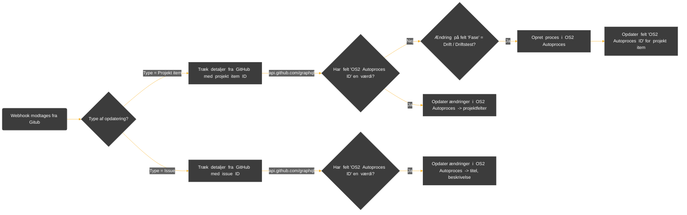

# OS2 Autoproces Updater `README.md`
[**Formål**](#formål) | [**Beskrivelse**](#beskrivelse) | [**Afhængigheder**](#afh%C3%A6ngigheder)

## Formål

Formålet med applikationen er at automatisk oprette samt opdatere processer i OS2 Autoproces med idriftsatte applikationer fra et GitHub Projekt.

Projekter oprettes automatisk i OS2 Autoproces når de markeres som idriftsat i GitHub projektets dertil oprettet feltværdi "Fase". Herefter opdateres værdi for feltet "OS2 Autoproces ID" i GitHub med ID den nye proces.

Projekter opdateres herefter automatisk i OS2 Autoproces ved efterfølgende ændringer, såfremt værdi for "OS2 Autoproces ID" er sat.

Applikationen benytter Azure OpenAI Responses-API til at danne et resume på maks 140 tegn ud fra beskrivelsen i  det pågældende issue når processen oprettes i OS2 Autoproces, samt ved efterfølgende opdateringer af beskrivelsen.

## Beskrivelse

Applikationen modtager webhooks fra GitHub ved opdatering af `Project v2 items` samt `Issues` på applikationens endpoint `/api/webhook`. 

Herefter trækkes yderligere data om det ændrede projekt item/issue fra GitHub med et GraphQL API-kald til `api.github.com/graphql`. Feltværdi for "OS2 Autorproces ID" som bruges til at identificere om der allerede eksisterer en proces i OS2 Autorproces.

Findes der ikke proces, oprettes denne såfremt ændringen er en markering af idriftsættelse (ændring af feltværdi for "Fase" til `6. Driftstest`, eller `7. Drift`). Herefter opdateres værdi for feltet "OS2 Autoproces ID" i GitHub med ID den nye proces.

Eksisterer der allerede en proces, opdateres denne i OS2 Autoproces med nye ændringer.

***OBS**: Processdiagram er simplificeret, og beskriver bl.a. ikke  API-kald til Azure OpenAI samt mapping af feltværdier for felterne "Teknologi" samt "Skedulering"*.

## Afhængigheder

Applikationen kræver opsætning af en GitHub projekt med følgende felter:

| Feltnavn          | Type       | Listeværdier                                                                                      |
|-------------------|------------|---------------------------------------------------------------------------------------------------|
| Fase              | Liste      | "6. Driftstest", "7. Drift"                                                                       |
| Teknologi         | Liste      | *Teknologier fra OS2 Autoproces*                                                                    |
| Skedulering       | Liste      | "Engangskørsel", "Løbende kørsel", "Dagligt", "Ugentligt", "Månedligt", "Hvert kvartal", "Årligt" |
| OS2 Autoproces ID | Tekstværdi |                                                                                                   |

Applikationen kræver en opsætning af GitHub webhook med triggers på `Project v2 items` samt `Issues`, som peges på applikationens endpoint `/api/webhook` (*Content-Type:* `application/json`).

Følgende miljøvariabler kræves:

:heavy_dollar_sign: | `OS2AUTOPROCES_API_KEY`, `OS2AUTOPROCES_API_URL`, `OS2AUTOPROCES_XAPI_URL`, `GITHUB_ACCESS_TOKEN`, `GITHUB_API_URL`, `GITHUB_PROJECT_ID`, `GITHUB_OS2AUTOPROCES_FIELD_ID`, `AZURE_OPENAI_API_KEY`, `AZURE_OPENAI_ENDPOINT`, `AZURE_DEPLOYMENT_NAME`, `CONTACT_EMAIL`

Miljøvariablen `CONTACT_EMAIL`  benyttes til at udfylde feltet "Anden kontaktinformation" i OS2 Autoproces. 

Applikationen er bygget i

:gear: | Python

Applikationen kræver følgende netværksadgange

:cloud: | Ingress som tillader GitHub webhooks, Egress til `api.github.com` samt `os2autoproces.eu`.
